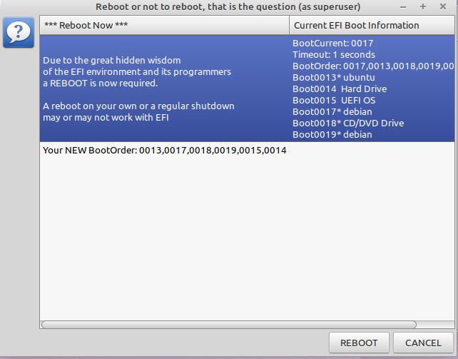

# EFI-New-Sort
 
## Description

With the *efibootmgr* program you are able to handle *UEFI* issues. This bash script allows to rearrange the EFI boot order. If your Linux/Unix works without *UEFI* it is pretty useless.

I use *YAD* as the GUI inside bash. 

## Dependencies 

Required is the good old bash. It should run with most newer versions.

yad, as the display manager : `apt install yad`

efibootmgr, the Linux UEFI manager: `apt install efibootmgr`

Normally any version and combination of the software above will do the job.

## Required 

Superuser power as in `root`. No mere mortal is allowed to play around with efi power.
+ su -p for a root shell: _# bash  ./efinewsort.sh 
+ sudo bash ./efinewsort.sh 
 
## Get help 

bash ./efinewsort.sh -h  opens the following screen

 
+ You get an overview of your current boot order 

## Start Display

Rearrange your boot order. Sort Up with the left radio button, Sort Down with the right radio button. 
Pretty simple. To speed up things you can do it at the same time. **Sort** sets the new boot order.
Rearrange further or push **Finish** to end the sorting game.

## Final Display 

Compare `Old` and `New` BootOrder. If everything is fine choose **Reboot**  to finalize everything.
**Cancel** brings the previous screen back.   

## Changes
+ 2022.11.06 VERSION=0.4 finalized README   
+ 2022.11.05 VERSION=0.3 added help, final decision, cleanup   
+ 2022.11.03 VERSION=0.2 added efinewbootsort file as workaround 
+ 2022.11.01 VERSION=0.1 efinewboot.sh is base - see on GitHub EFI-New-Boot
         
## Missing Things I am working on
+ Preventing useless boot if nothing changes
+ A do nothing and leave option

## Tags

EFI UEFI EFIBOOTMGR LINUX UBUNTU MINT DEBIAN YAD EFI-New-Boot EFI-New-Sort